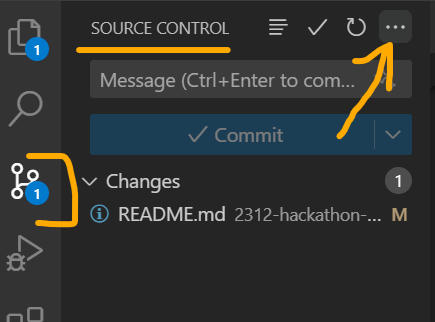
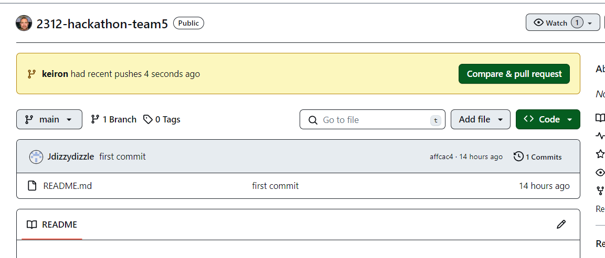

# **Title**

Introduction:

Live deployment link can be found [here](https://jwalshe86.github.io/2312-hackathon-team5/).

# Table of Contents

1. [Project Goals](#project-goals "ProjectGoals")
2. [User Experience](#user-experience "User Experience")
   - [Target Audience](#target-audience "Target Audience")
   - [User Requirements and Expectations](#user-requirements-and-expectations "User Requirements and Expectations")
   - [User Stories](#user-stories "User Stories")
3. [Design](#design "Design")
   - [Design Choices](#design-choices "Design Choices")
   - [Colour](#colour "Colour")
   - [Fonts](#fonts "Fonts")
   - [Wireframes](#wireframes "Wireframes")
4. [Technologies, Languages & Programs Used](#technologies-languages--programs-used)
5. [Features](#features "Features")
   - [Existing Features](#existing-features "Existing Features")
   - [Future Features](#future-features "Future Features")
   - [Responsiveness](#responsiveness "Responsiveness")
6. [Testing](#testing "Testing")
   - [Bugs](#bugs "Bugs")
   - [Validator Testing](#validator-testing "Validator Testing")
7. [Deployment, Development & Version Control](#deployment-development--version-control)
8. [Credits](#credits "Credits")

## **Project Goals**

To be added.

## **User Experience**

To be added.

## **Target Audience**

To be added.

## **User Stories**

To be added.

## **Design**

### **Design Choices**

To be added.

### **Colour**

To be added

### **Fonts**

To be added.

### **Wireframes**

The website was designed using a mobile-first approach using [Marvel](https://marvelapp.com/prototype/106ce031). Follow the link to visualise the initial concept of user navigation.

## **Technologies, Languages & Programs Used**

To be added.

## **Features**

To be added.

### **Existing Features**

To be added.

### **Responsiveness**

To be added.

## **Testing**

### **Manual Testing**

Manual testing following the User Stories was carried out throughout the development of the project, with the final results available below.

- As a **user**, I want () so that I ().

| **Test** | Issue | Result |
| -------- | ----- | ------ |
| 1        | ()    | PASS   |

## **Bugs**

### **Fixed bugs**

To find a list of fixed bugs that were mended during development, please click [here]().

### **Remaining bugs**

To be added.

## **Validator Testing**

### **HTML Validator**

The [W3C Markup Validation Service](https://validator.w3.org/) for the HTML code was passed in as a URL and returned x errors.

### **CSS Validator**

The [W3C CSS Validation Service](https://jigsaw.w3.org/css-validator/) for the CSS code was passed in as source code and returned x errors.

### **JSHint**

The [JSHint Validation Service](https://jshint.com/) for the JavaScript code was passed in as source code and returned x errors.

## **Deployment, Development & Version Control**

The development environment used for this project was VSCode.

Each software developer on the team created their own individual branch divergent from main from the get-go and have communicated via Slack to collaborate, pitch ideas, fix bugs and talk about relevant Pull Requests. Regular commits and pushes to Github have been employed to be able to track and trace the development process of the web application.

For local deployments instructions shall be written below, along with instructions with deployment to GitHub Pages, the hosting service used to deploy this particular website.

### **Local Deployment**

This repository can be cloned and run locally with the following steps:

- Login to GitHub.
- Select repository named: https://github.com/JWalshe86/2312-hackathon-team5
- Click code toggle button and copy the url (i.e., https://github.com/JWalshe86/2312-hackathon-team5.git).
- In your IDE, open the terminal and run the git clone command (i.e., git clone https://github.com/JWalshe86/2312-hackathon-team5.git). The repository will now be cloned in your workspace.

### **Deployment to GitHub**

The live version of the project is deployed at GitHub pages.

The procedure for deployment followed the "Creating your site" steps provided in GitHub Docs.

- Log into Github.
- Select desired GitHub Repository to be deployed live.
- Underneath the repository name, click the “Settings” option.
- In the sub-section list on the left, under “Code and automation”, click “Pages”.
- Within the ”Source” section choose ”main” as Branch and root as folder and click ”Save”.
- The page refreshes and a website shall then deploy via a link.
- The following is the live link deployed: https://jwalshe86.github.io/2312-hackathon-team5/

## **Credits**

### **Media**

To be added.

### **Acknowledgments**

This project was created in collaboration by [Team x](https://hackathon.codeinstitute.net/teams/379/): Alan Chapman, Julia Maluk, John Walshe, Keiron Chaudhry.

## **PULL REQUEST INSTRUCTIONS**

# **Branches and Pull Requests

## **Creating a Branch**

There are multiple ways to create a branch in your IDE (Integrated development environment), but this is one of the easiest:

* Go to the GitHub repository for this project.

* You should be able to locate "Branch" (it'll normally say "1 branch" if there's just one, or "2 branches" etc.,). Click it.

* Then click "New branch". You can name it whatever but I would recommend calling it your name (in my case, I've named it "keiron").

Done.

Another way:

* Go into your actual IDE, and go to the Source Control panel. This can be found underneath the search tab on the left side of the screen in GitPod (should be the same for Code Anywhere and VSCode).

* Then click on the three dot dropdown component up top (see attached photo)

* Go to Branch > Create branch > Enter desired branch name

Done. _You will need to "Publish branch" in Source Control_, and then it can be seen in the GitHub Repo.

Once you've done this, in your IDE, go right down to the branch label (I will attach a photo).

Click this and it will bring up a list of existing branches. Click the one you have made.

You should notice then that the branch label has changed to your named branch.

**Useful commands**

A list of useful commands when you're working from branches are:

`git status` (tells you which branch you're on and if you're behind/ahead of main branch)

`git pull origin main` (this is very important, please git pull everytime you merge a pull request, or see a pull request being merged, as it avoids merge conflicts. all you have to do is commit your last update (or stash it), and then run this command, and carry on with what you're doing in your branch)

`git add`

`git commit -m your commit message`

`git push origin your branch name (I recommend just going into source control and clicking Sync changes)`

`git switch (branch name)` (allows you to switch branch instantaneously)

`git stash` (when you're in the middle of making changes and someone merges a PR, you can git stash your changes away temporarily, git pull from main, and then...)

`git stash pop` (... you can git stash pop your changes back into your IDE. alelujah!)

## **Creating a Pull Request (known as a "PR")**

When you've pushed changes to your branch, you can then head over to the GitHub repository for the Pride Hackathon and normally there appears an unmissable message saying that you can merge changes and begin a pull request.

In case you've pushed changes and this message doesn't appear, don't worry, just go back into "branches", find your name, and alongside your branch name, there'll be a button for "New Pull Request".

Once you've begun a PR, it will appear in the "Pull Requests" (next to "Issues") part of the GitHub repository, and you can manage it from there before merging your changes with main.

Please always tag reviewers (you can tag anybody or everybody) to take a look at the changes before merging.

**IMPORTANT**

When you make a branch, _there always exists two versions of it_, one in your IDE and the remote branch in GitHub. This sounds strange at first but it should begin to make sense as you repetitiously use the Git commands.

So when I made 'keiron', I now have the 'keiron' branch open in my IDE (Integrated development environment, which is a fancy way of saying "coding environment", i.e., VSCode, Gitpod, CodeAnywhere etc.), where I am modifying the code. And then I push these changes to the 'keiron' branch in GitHub (_the remote branch_), where I can then merge that branch with the main remote branch.

This is noteworthy because after every successfully merged Pull Request, you must always `git pull origin main` and then go to Source Control and click `Sync Changes`, to make sure the remote version of your branch is also up to date with your coding environment (IDE). If these branches aren't up to date, we could experience what's called a merge conflict, which I will explain below in the potential problems section.

**Potential problems**

When a lot of PRs go up, a "merge conflict" can happen. This is okay and it's bound to happen, it's part of the experience of a hackathon as well (and also working in a team). It can occur for a variety of complex reasons.

An example of how it can occur is when changes are being made by various branches on the same content (say that "john" and "keiron" are working on the exact same part of the README.md file, and then we do a PR, or if one of us has forgotten to git pull to make sure our IDE and remote branches are up to date before we began our changes).

Of course the best way to avoid it is to try and always make sure your branch is up to date and to work on completely different sections. Make sure we make clear our tasks, roles and what it is we are working on within the file we are working in.

If it happens we will just deal with it but let's try avoid it xD

**Note**

I've tried my best to be as comprehensive as possible in this so that any new-hackathoners and those who are new to branching and PRs can be informed, but overall we will deal with any potential issues as a team. :D

### Bugs

While trying to push some content to the main remote repository I found that I got the following error:
.  When I looked into this further, it could have been avoided by checking the difference between my local branch and the main remote branch by using 'git diff johnBranch origin/main. This would have shown me if my branch was in sync with the remote branch. This error was fixed by then pulling information from the remote main branch before pushing again. . I just used 'git diff johnBranch origin/main' and nothing showed up - meaning there's no difference between my Branch and the remote main branch. So I will just push this added readme content with git push -u origin main. I got the following error again: . When I git pull it appears find:. Git Branch -v shows . It looks like I need to merge content from another colleague. Research of similar issues on stackoverflow, who others stating that sometimes the only way to resolve the issue is to use 'git force'. This appears to have fixed the issue and the error no longer shows up when I try push commits to the main repository. As my liveserver looked the exact same as the most up-to-date work our team had done on the project, I was confident forcing this push would be okay . 

### CREDITS - TO BE RETAINED FOR FINAL README

The favicon is courtesy of 
<a href="https://www.flaticon.com/free-icons/christmas" title="christmas icons">Smashicons via Flaticon</a>