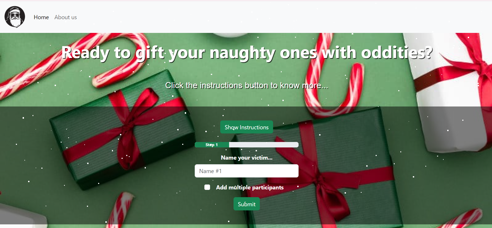
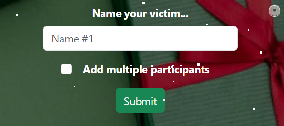
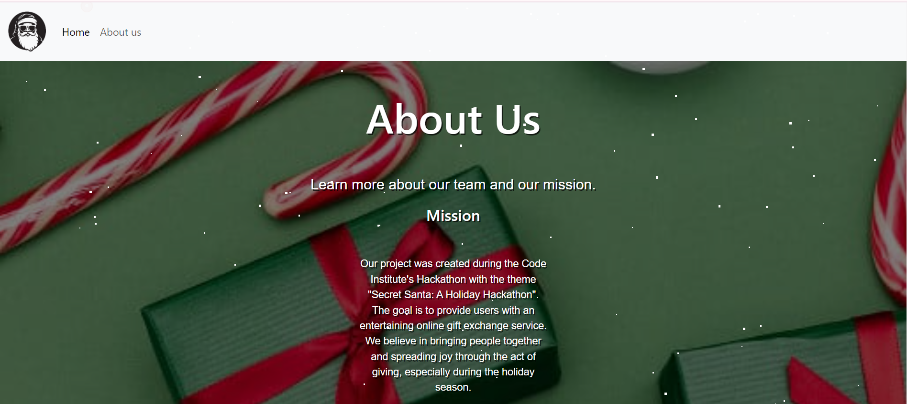
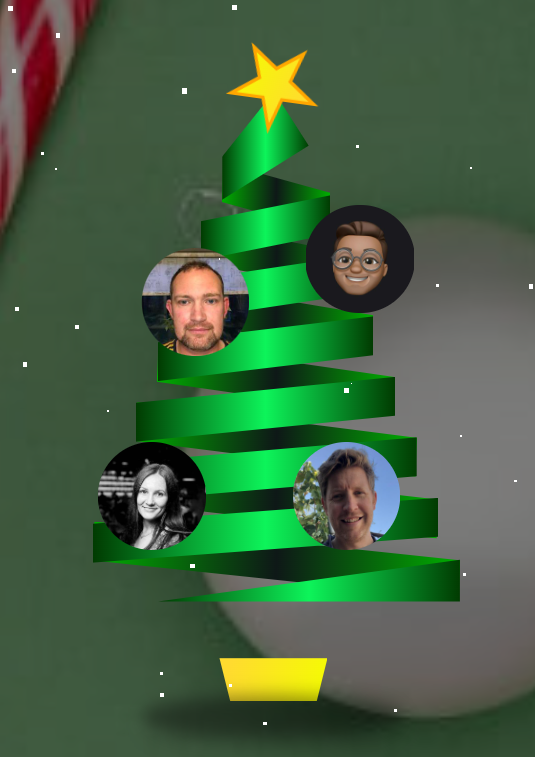

# **Cheeky Santa**

Cheeky Santa is a fictional gift-gag application where users can enter in a name of any person they may know, and the application generates an odd gift, which then produces a voucher with an address for users to go and purchase the item. The idea and project was developed as a part of Code Institute's December 2023 Hackathon.

Live deployment link can be found [here](https://jwalshe86.github.io/2312-hackathon-team5/).

# Table of Contents

1. [Project Goals](#project-goals "ProjectGoals")
2. [User Experience](#user-experience "User Experience")
   - [Target Audience](#target-audience "Target Audience")
   - [User Requirements and Expectations](#user-requirements-and-expectations "User Requirements and Expectations")
   - [User Stories](#user-stories "User Stories")
3. [Design](#design "Design")
   - [Design Choices](#design-choices "Design Choices")
   - [Colour](#colour "Colour")
   - [Fonts](#fonts "Fonts")
   - [Wireframes](#wireframes "Wireframes")
4. [Technologies, Languages & Programs Used](#technologies-languages--programs-used)
5. [Features](#features "Features")
   - [Existing Features](#existing-features "Existing Features")
   - [Future Features](#future-features "Future Features")
   - [Responsiveness](#responsiveness "Responsiveness")
6. [Testing](#testing "Testing")
   - [Bugs](#bugs "Bugs")
   - [Validator Testing](#validator-testing "Validator Testing")
7. [Deployment, Development & Version Control](#deployment-development--version-control)
8. [Credits](#credits "Credits")

## **Project Goals**

Based on the Code Institute Hackathon December 2023 Theme of "Secret Santa", create an application which follows the theme of a Virtual Gift Exchange Platform. This project should ideally be within the theme of Christmas and we decided to give it a humorous touch by making it a gag-gift application.

## **User Experience**

Welcome to Cheeky Santa, your go-to destination for a lighthearted and entertaining Secret Santa experience! 🎅✨

**Input a Name**: Start the fun by entering a name in the provided form. Cheeky Santa will do the rest!

**Randomly Odd Gifts**: Experience the magic of Cheeky Santa as it randomly selects amusing gifts associated with the entered names.

**Instant PDF Voucher**: Receive a custom PDF voucher, guiding you on how to redeem the selected quirky item.

**Purchase for a Cause**: When you decide to buy the selected item, not only do you ensure a good time, but 50% of the proceeds go to charity. Spread joy and make a difference!

## **Target Audience**

Our target audience is anybody wanting to buy gifts for Christmas.

## **User Stories**

As a **user**, I want **to be able to view a consistent colour scheme across the application** so that **its navigation feels like a smooth transition**.

As a **user**, I want **to be able to find and access the navigation bar** so that I can **navigate around the application with ease**.

As a **user**, I want **to be able to view the footer** so that I can **view any extra beneficial information regarding the application**.

As a **user**, I want **to be able to land on the home page** so that I am **able to have a central point of contact in the application**.

As a **user**, I want **to be able to generate a gift idea** so that I can **obtain instant information on a gift for Christmas**.

As a **user**, I want **to be able to find instructions** so that I can **obtain information on how the application functions**.

As a **user**, I want **to be able to create gift ideas using paired names** so that I can **generate Secret Santa ideas**.

## **Design**

### **Design Choices**

To be added.

### **Colour**

To be added

### **Fonts**

To be added.

### **Wireframes**

The website was designed using a mobile-first approach using [Marvel](https://marvelapp.com/prototype/106ce031). Follow the link to visualise the initial concept of user navigation.

## **Technologies, Languages & Programs Used**

* [HTML](https://www.w3schools.com/html/): Markup language for creating web pages.
* [CSS](https://www.w3schools.com/CSS/): Stylesheet language for styling the appearance of web pages.
* [JavaScript](https://www.javascript.com/): Programming language for adding interactivity to web pages.
* [Bootstrap](https://getbootstrap.com/docs/5.3/getting-started/introduction/): CSS framework for creating responsive and modern web designs.
* [GitHub](https://github.com/): Web-based platform for version control and collaboration on software projects.
* [GitHub Pages](https://pages.github.com/): Hosting service provided by GitHub for publishing static web pages.
* [Google Fonts](https://fonts.google.com/): Library of free and open-source web fonts.
* [Google Lighthouse](https://developer.chrome.com/docs/lighthouse/overview/): Automated tool for auditing and improving web page quality.
* [W3C Validator](https://validator.w3.org/): Tool for checking HTML and CSS code compliance with web standards.
* [JSHint](https://jshint.com/): Static code analysis tool for detecting errors and potential issues in JavaScript code.
* [VSCode](https://code.visualstudio.com/): Free and highly extensible source code editor with built-in features for editing, debugging, and version control integration. It supports various programming languages and is available for multiple platforms.

## **Features**

The application structure consists of:

* "Landing/Home" Page
* "About Me" Page

### **Existing Features**

* Landing page where user first arrives upon opening of application.
* As across all pages, snow-effect is present
* As across all pages, mouse-effect is present
* Sub-title that invites the user to use the application

 

* Instructions button that reveals how to use the application to user

* Progress bar that indicates the three stages of the application

* Input field for users to enter name
* Checkbox to add multiple names

* "About Us" which features information about the collaborators of this project
* Explains the core idea behind the project.

* Features an animated Christmas tree displaying the collaborators involved.

* Footer available at the bottom of every page.

### **Responsiveness**

To be added.

## **Testing**

### **Manual Testing**

Manual testing following the User Stories was carried out throughout the development of the project, with the final results available below.

- As a **user**, I want () so that I ().

| **Test** | Issue | Result |
| -------- | ----- | ------ |
| 1        | ()    | PASS   |

## **Bugs**

### **Fixed bugs**

To find a list of fixed bugs that were mended during development, please click [here](https://github.com/JWalshe86/2312-hackathon-team5/pulls?q=is%3Apr+is%3Aclosed+label%3Abug).

Some extra bugs:

* While trying to push some content to the main remote repository I found that I got the following error:
.  When I looked into this further, it could have been avoided by checking the difference between my local branch and the main remote branch by using 'git diff johnBranch origin/main. This would have shown me if my branch was in sync with the remote branch. This error was fixed by then pulling information from the remote main branch before pushing again. . I just used 'git diff johnBranch origin/main' and nothing showed up - meaning there's no difference between my Branch and the remote main branch. So I will just push this added readme content with git push -u origin main. I got the following error again: . When I git pull it appears find:. Git Branch -v shows . It looks like I need to merge content from another colleague. Research of similar issues on stackoverflow, who others stating that sometimes the only way to resolve the issue is to use 'git force'. This appears to have fixed the issue and the error no longer shows up when I try push commits to the main repository. As my liveserver looked the exact same as the most up-to-date work our team had done on the project, I was confident forcing this push would be okay . 

### **Remaining bugs**

To be added.

## **Validator Testing**

### **HTML Validator**

The [W3C Markup Validation Service](https://validator.w3.org/) for the HTML code was passed in as a URL and returned x errors.

### **CSS Validator**

The [W3C CSS Validation Service](https://jigsaw.w3.org/css-validator/) for the CSS code was passed in as source code and returned x errors.

### **JSHint**

The [JSHint Validation Service](https://jshint.com/) for the JavaScript code was passed in as source code and returned x errors.

## **Deployment, Development & Version Control**

The development environment used for this project was VSCode.

Each software developer on the team created their own individual branch divergent from main from the get-go and have communicated via Slack to collaborate, pitch ideas, fix bugs and talk about relevant Pull Requests. Regular commits and pushes to Github have been employed to be able to track and trace the development process of the web application.

For local deployments instructions shall be written below, along with instructions with deployment to GitHub Pages, the hosting service used to deploy this particular website.

### **Local Deployment**

This repository can be cloned and run locally with the following steps:

- Login to GitHub.
- Select repository named: https://github.com/JWalshe86/2312-hackathon-team5
- Click code toggle button and copy the url (i.e., https://github.com/JWalshe86/2312-hackathon-team5.git).
- In your IDE, open the terminal and run the git clone command (i.e., git clone https://github.com/JWalshe86/2312-hackathon-team5.git). The repository will now be cloned in your workspace.

### **Deployment to GitHub**

The live version of the project is deployed at GitHub pages.

The procedure for deployment followed the "Creating your site" steps provided in GitHub Docs.

- Log into Github.
- Select desired GitHub Repository to be deployed live.
- Underneath the repository name, click the “Settings” option.
- In the sub-section list on the left, under “Code and automation”, click “Pages”.
- Within the ”Source” section choose ”main” as Branch and root as folder and click ”Save”.
- The page refreshes and a website shall then deploy via a link.
- The following is the live link deployed: https://jwalshe86.github.io/2312-hackathon-team5/

## **Credits**

### **Media**

The favicon is courtesy of [Smashicons via Flaticon](https://www.flaticon.com/free-icons/christmas).

### **Acknowledgments**

This project was created in collaboration by [Team x](https://hackathon.codeinstitute.net/teams/379/): Alan Chapman, Julia Maluk, John Walshe, Keiron Chaudhry.
